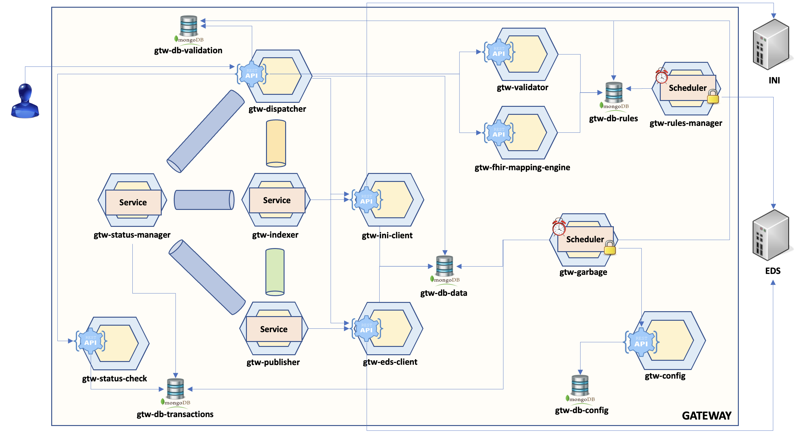
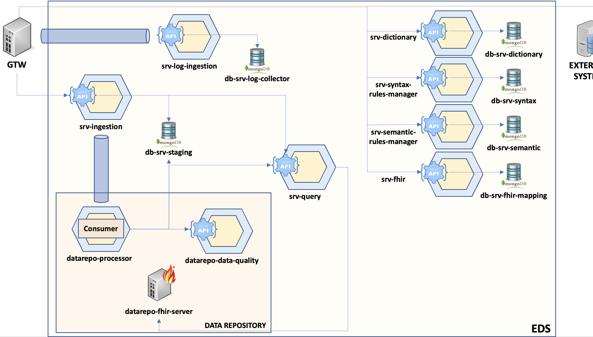

# Fascicolo Sanitario 2.0

# _it-fse-gtw-test-container_

In questo repository è presente un file `docker-compose` che consente di avviare un'istanza locale del **gateway** di FSE 2.0.

 

## Requisiti:
* docker
* docker-compose
* 16 GiB di RAM

 

## Tipologie di Container:
Sono attualmente presenti due differenti istanze in due branch distinti:
* Versione *lite* [[link](https://github.com/ministero-salute/it-fse-gtw-test-container/tree/feature/container-lite)]: La seguente versione contiene il sottoinsieme minimo di microservizi necessari ad invocare i seguenti endpoint 
  * POST `/documents/validation`: il servizio consentirà di validare il documento CDA2 fornito in input.
  * POST `/documents`: il servizio consentirà di trasformare il documento CDA2 fornito in input in Bundle FHIR.

 

 

* Versione *full* [[link](https://github.com/ministero-salute/it-fse-gtw-test-container/tree/feature/container-full)]:
La seguente versione contiene tutti i microservizi di **gateway** ed **eds** ad oggi sviluppati.

 

 

**N.B.** Lo strato di persistenza di entrambe le versione è prepopolato con i configuration items necessari al corretto funzionamento di FSE 2.0.

 

## Preparazione:

Per prima cosa è **necessario** creare un file `.env` copiando il file `.env-sample`. 
Il file è opportunamente inizializzato con il `REPO_BASE_URL` e il `CURRENT_BRANCH` da cui scaricare il codice dei microservizi del gateway.

Ad esempio:

    REPO_BASE_URL="https://github.com/ministero-salute"
    CURRENT_BRANCH=main

 

## Avvio:

Per avviare i container che compongono il gateway è sufficiente posizionarsi nella directory contenente il file `docker-compose.yaml` e lanciare il comando 

    docker-compose up

Verranno create le immagini e messi in esecuzione i container che compongono il gateway.

 

**N.B.** Il nome dei container generato è dipendente dal nome della directory in cui si trova il file docker-compose, in questo caso *it-fse-gtw-test-container*

Potrebbero essere necessari **alcuni minuti** perché il sistema sia pronto, durante il primo avvio in particolare vengono scaricati e compilati i sorgenti e le librerie delle dipendenze dei microservizi, questo può richiedere parecchio tempo.

 

## Test:
Per poter eseguire i test situati nella directory `tests` è necessario:
* Visual Studio Code
* Estensione REST Client
* Creare un file `.env` copiando il contenuto del file `.env-sample` presente nella directory `tests` 

 

Al termine dell'installazione di `REST Client` sarà possibile avviare i servizi di validazione e creazione (files .http) tramite il tasto `Send Request` che comparirà sopra ogni API.

 

## Troubleshooting:

Assicurarsi che tutti i container siano instato **running** tramite GUI di `Docker Desktop` o tramite il comando
    
    docker ps -a --format="table {{.ID}}\t{{.Names}}\t{{.Image}}\t{{.State}}"

L'output atteso dal seguente comando è il seguente:

| CONTAINER ID | NAMES | IMAGE | STATE |
|--------------|-------|-------|-------|
|f84330c03b5b  | it-fse-gtw-test-container-it-fse-gtw-status-check-1        | it-fse-ms-runner                  | running
|395d5024e63b  | it-fse-gtw-test-container-it-fse-gtw-dispatcher-1          | it-fse-ms-runner                  | running
|2b33b4bf4504  | it-fse-gtw-test-container-it-fse-gtw-fhir-mapping-engine-1 | it-fse-ms-runner                  | running
|ba7aa381fb61  | it-fse-gtw-test-container-it-fse-gtw-status-manager-1      | it-fse-ms-runner                  | running
|cb102c0be90e  | it-fse-gtw-test-container-it-fse-gtw-validator-1           | it-fse-ms-runner                  | running
|1de45c7e315c  | it-fse-gtw-test-container-it-fse-srv-log-ingestion-1       | it-fse-ms-runner                  | running
|3f1ef0f0fa94  | it-fse-gtw-test-container-mongo-1                          | mongo:4.2                         | running
|3fb5f91d61a3  | it-fse-gtw-test-container-kafka-1                          | confluentinc/cp-kafka:6.2.1       | running
|b561e8c7a241  | it-fse-gtw-test-container-zookeeper-1                      | confluentinc/cp-zookeeper:latest  | running

 

Se un container non fosse in esecuzione (ad esempio a causa di un out of memory) è possibile farlo partire con il comando

    docker start NOME_CONTAINER

Una volta avviato sarà possibile utilizzare come endpoint di collegamento `http://localhost:8010` corrispondente all'indirizzo del microservizio dispatcher incaricato di esporre i servizi.

 

## Repos
- [it-fse-support](https://github.com/ministero-salute/it-fse-support) - Pagina di supporto FSE 2.0
- [it-fse-landing](https://github.com/ministero-salute/it-fse-landing) - Landing page dei repository FSE 2.0