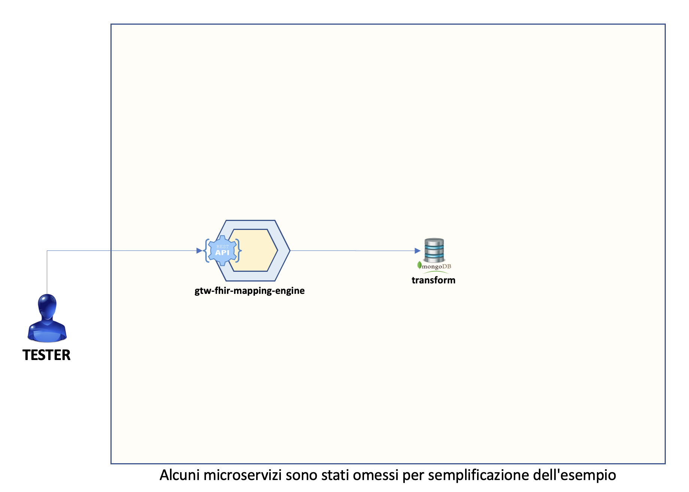

# Fascicolo Sanitario 2.0

# _it-fse-gtw-test-container_

In questa directory è presente un file `docker-compose` che consente di avviare un'istanza locale dell'engine che trasfomra file CDA in FHIR.

La seguente versione contiene il sottoinsieme minimo di microservizi necessari ad invocare i seguenti endpoint
* POST `/v1/documents/transform/stateless/{engineId}/{objectId}`: Il servizio genera un Bundle tramite il FHIR Mapping Engine. engineId: identificativo dell’engine configurato nel database; objectId: identificativo della configurazione/mapping associato alla specifica tipologia di file CDA in input.
* GET `/v1/engine/status`: Restituisce lo stato corrente degli engine disponibili per la trasformazione dei file CDA.
* GET `/v1/engine/refresh`: Aggiorna la lista degli engine disponibili nel database.
* GET `/status`: Consente di conoscere lo stato dell'applicazione

**DISCLAIMER: Il json FHIR in output ottenuto dal servizio di trasformazione non e' la versione definitiva che verrà inserito all'interno del server fhir, in quanto la UAR applica ulteriori raffinamenti.**

 

 

## Preparazione:

Per prima cosa è **necessario** creare un file `.env` copiando il file `.env-sample` presente nella directory corrente.
Il file è opportunamente inizializzato con il `REPO_BASE_URL` e il `CURRENT_BRANCH` da cui scaricare il codice dei microservizi del gateway. Inoltre è presente `MONGO_DUMP_URL` che rappresenta l'url da cui verranno scaricati i file `.json` utili al riempimento del database Mongo.

Ad esempio:

    REPO_BASE_URL="https://github.com/ministero-salute"
    MONGO_DUMP_URL="https://raw.githubusercontent.com/ministero-salute/it-fse-catalogs/main/mongo-dump"
    CURRENT_BRANCH=main

Successivamente, seguire i seguenti passaggi per la configurazione di Python:

1. Installare [Python](https://www.python.org/downloads/)
2. Aprire il prompt di comandi e digitare `pip install python-dotenv`

Prima di avviare i container bisogna effetturare il download dei file JSON utili al riempimento del database Mongo.

Per fare questo bisogna andare nella cartella della versione scelta (Es. `it-fse-container-fhir-transform`) ed eseguire lo script python `mongo-dump.py`. Lo script effettuerà il download della versione più aggiornata dei seguenti file:
* `transform.json`
* `engines.json`

Al termine dell'operazione sarà stata creata una cartella `mongo-dump` nella cartella root.

## Avvio:

Per avviare i container che compongono il Gateway è sufficiente posizionarsi da terminale nella directory contenente il file `docker-compose.yaml` e lanciare il comando

    docker-compose up

Verranno create le immagini e messi in esecuzione i container che compongono il gateway.

 

**N.B.** Il nome dei container generato è dipendente dal nome della directory in cui si trova il file docker-compose, in questo caso *it-fse-gtw-container-fhir-transform*

Potrebbero essere necessari **alcuni minuti** perché il sistema sia pronto, durante il primo avvio in particolare vengono scaricati e compilati i sorgenti e le librerie delle dipendenze dei microservizi, questo può richiedere parecchio tempo.

 

Una volta avviato sarà possibile utilizzare come endpoint di collegamento http://localhost:8022 corrispondente all'indirizzo del microservizio dispatcher incaricato di esporre i servizi. È possibile inoltre consultare lo swagger al seguente link http://localhost:8022/openapi/swagger-ui/index.html

 

## Troubleshooting:

Assicurarsi che tutti i container siano in stato **running** tramite GUI di `Docker Desktop` o tramite il comando

    docker ps -a --format="table {{.ID}}\t{{.Names}}\t{{.Image}}\t{{.State}}"

L'output atteso dal seguente comando è il seguente:

| CONTAINER ID | NAMES                                                      | IMAGE                            | STATE   |
|--------------|------------------------------------------------------------|----------------------------------|---------|
| 2b33b4bf4504 | it-fse-gtw-fhir-transform-it-fse-gtw-config-1              | it-fse-ms-runner                 | running |
| 2b33b4bf4504 | it-fse-gtw-fhir-trasform-it-fse-gtw-fhir-mapping-engine-1  | it-fse-ms-runner                 | running |
| 3f1ef0f0fa94 | it-fse-gtw-fhir-trasform-mongo-1                           | mongo:4.2                        | running |

 