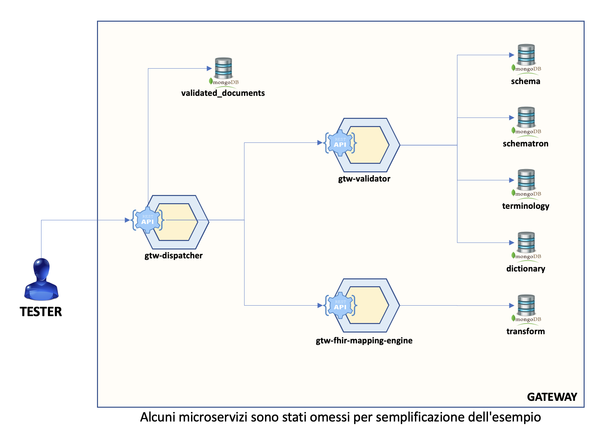

# Fascicolo Sanitario 2.0

# _it-fse-gtw-test-container_

In questa directory è presente un file `docker-compose` che consente di avviare un'istanza locale *lite* del **gateway** di FSE 2.0.

La seguente versione contiene il sottoinsieme minimo di microservizi necessari ad invocare i seguenti endpoint
* POST `/documents/validation`: il servizio consentirà di validare il documento CDA2 fornito in input.
* POST `/documents`: il servizio consentirà di trasformare il documento CDA2 fornito in input in Bundle FHIR.
* GET `/status`: il servizio consentirà di conoscere lo stato della transazione fornendo in input il workflowInstanceId o il traceID.

<br/>

[](container-lite.png)

<br/>

## Preparazione:

Per prima cosa è **necessario** creare un file `.env` copiando il file `.env-sample` presente nella directory corrente.
Il file è opportunamente inizializzato con il `REPO_BASE_URL` e il `CURRENT_BRANCH` da cui scaricare il codice dei microservizi del gateway. Inoltre è presente `MONGO_DUMP_URL` che rappresenta l'url da cui verranno scaricati i file `.json` utili al riempimento del database Mongo.

Ad esempio:

    REPO_BASE_URL="https://github.com/ministero-salute"
    MONGO_DUMP_URL="https://raw.githubusercontent.com/ministero-salute/it-fse-catalogs/main/mongo-dump"
    CURRENT_BRANCH=main

Successivamente, seguire i seguenti passaggi per la configurazione di Python:

1. Installare [Python](https://www.python.org/downloads/)
2. Aprire il prompt di comandi e digitare `pip install python-dotenv`

Prima di avviare i container bisogna effetturare il download dei file JSON utili al riempimento del database Mongo.

Per fare questo bisogna andare nella cartella della versione scelta (Es. `it-fse-container-lite`) ed eseguire lo script python `mongo-dump.py`. Lo script effettuerà il download della versione più aggiornata dei seguenti file:
* `config_data.json`
* `schema.json`
* `schematron.json`
* `transform.json`
* `terminology.json`

Al termine dell'operazione sarà stata creata una cartella `mongo-dump` nella cartella root.

## Avvio:

Per avviare i container che compongono il Gateway è sufficiente posizionarsi da terminale nella directory contenente il file `docker-compose.yaml` e lanciare il comando

```bash
docker compose up
```

Verranno create (se necessario) le immagini ed eseguiti i container che compongono il Gateway.

<br/>


**N.B.** Il nome dei container generati dipende dal nome della directory in cui si trova il file docker-compose.yaml, in questo caso *it-fse-container-lite*

Potrebbero essere necessari **alcuni minuti** perché il sistema sia pronto, durante il primo avvio in particolare vengono scaricati e compilati i sorgenti e le librerie delle dipendenze dei microservizi, questo può richiedere parecchio tempo.

<br/>

Una volta avviato sarà possibile utilizzare come endpoint di collegamento http://localhost:8010 corrispondente all'indirizzo del microservizio dispatcher incaricato di esporre i servizi. 

La documentazione OpenAPI (Swagger UI) è disponibile all’indirizzo: http://localhost:8010/openapi/swagger-ui/index.html. Aprendo questo URL dal browser è possibile esplorare e testare le API esposte dal Gateway.

<br/>

## Troubleshooting:

Assicurarsi che tutti i container siano in stato **running** tramite GUI di `Docker Desktop` o tramite il comando

    docker ps -a --format="table {{.ID}}\t{{.Names}}\t{{.Image}}\t{{.State}}"

L'output atteso dal seguente comando è il seguente:

| CONTAINER ID | NAMES                                                      | IMAGE                            | STATE   |
|--------------|------------------------------------------------------------|----------------------------------|---------|
| f84330c03b5b | it-fse-gtw-container-lite-it-fse-gtw-config-1              | it-fse-ms-runner                 | running |
| 395d5024e63b | it-fse-gtw-container-lite-it-fse-gtw-dispatcher-1          | it-fse-ms-runner                 | running |
| f84330c03b5b | it-fse-gtw-container-lite-it-fse-gtw-status-check-1        | it-fse-ms-runner                 | running |
| ba7aa381fb61 | it-fse-gtw-container-lite-it-fse-gtw-status-manager-1      | it-fse-ms-runner                 | running |
| 2b33b4bf4504 | it-fse-gtw-container-lite-it-fse-gtw-fhir-mapping-engine-1 | it-fse-ms-runner                 | running |
| cb102c0be90e | it-fse-gtw-container-lite-it-fse-gtw-validator-1           | it-fse-ms-runner                 | running |
| 1de45c7e315c | it-fse-gtw-container-lite-it-fse-srv-log-ingestion-1       | it-fse-ms-runner                 | running |
| 3f1ef0f0fa94 | it-fse-gtw-container-lite-mongo-1                          | mongo:4.2                        | running |
| 3fb5f91d61a3 | it-fse-gtw-container-lite-kafka-1                          | confluentinc/cp-kafka:6.2.1      | running |
| b561e8c7a241 | it-fse-gtw-container-lite-zookeeper-1                      | confluentinc/cp-zookeeper:latest | running |

<br/>
