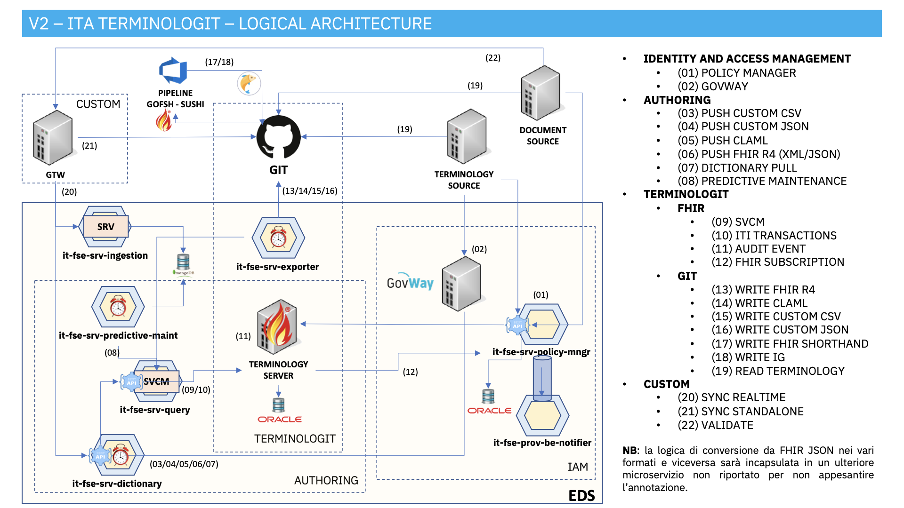

# Fascicolo Sanitario 2.0

# _it-fse-terminology_

In questa directory è presente un file `docker-compose` che consente di avviare un'istanza locale del **terminology-server** di FSE 2.0.
 

 

 

## Preparazione:

Per prima cosa è **necessario** creare un file `.env` copiando il file `.env-sample` presente nella directory corrente. 
Il file è opportunamente inizializzato con il `REPO_BASE_URL` e il `CURRENT_BRANCH` da cui scaricare il codice dei microservizi del terminology-server.

Ad esempio:

    REPO_BASE_URL="https://github.com/ministero-salute"
    CURRENT_BRANCH=main

 

## Avvio:

Per avviare i container che compongono il Terminology-server è sufficiente posizionarsi da terminale nella directory `it-fse-terminology` contenente il file `docker-compose.yaml` e lanciare il comando 

    docker-compose up

Verranno create le immagini e messi in esecuzione i container che compongono il terminology.

 

Potrebbero essere necessari **alcuni minuti** perché il sistema sia pronto, durante il primo avvio in particolare vengono scaricati e compilati i sorgenti e le librerie delle dipendenze dei microservizi, questo può richiedere parecchio tempo.
 

 
 

## Microservizi

Ecco la tabella aggiornata con le rispettive richieste curl per ogni microservizio:

## Microservizi

| Nome                                   | Descrizione                                                       | Porta  | Dipendenze                   | Comando curl                                                                                                                                                      |
|----------------------------------------|-------------------------------------------------------------------|--------|------------------------------|------------------------------------------------------------------------------------------------------------------------------------------------------------------|
| it-fse-srv-policy-manager              | Gestisce la politica di accesso ai servizi del terminology         | 10000  | kafka, oracle-xe             | curl -X GET 'http://localhost:10000/status' -H 'accept: application/json'                                                                                       |
| it-fse-prov-be-notifier                | Ha la responsabilità di inviare mail                               | 8083   | kafka, oracle-xe             | curl -X GET 'http://localhost:8083/status' -H 'accept: application/json'                                                                                         |
| it-fse-srv-converter                   | Ha la responsabilità di convertire da e verso il FHIR le terminologie | 8100   | kafka                        | curl -X GET 'http://localhost:8100/status' -H 'accept: application/json'                                                                                         |
| it-fse-srv-dictionary                  | Fornisce le API per l'upload di terminologie e URL per il web scraping                | 9088   | mongo                        | curl -X GET 'http://localhost:9088/status' -H 'accept: application/json'                                                                                         |
| it-fse-srv-log-ingestion               | Ha la responsabilità di collezionare i log dei microservizi        | 9097   | mongo, kafka                 | curl -X GET 'http://localhost:9097/status' -H 'accept: application/json'                                                                                         |
| it-fse-srv-predictive-maintainer       | Ha la responsabilità di scansionare i log strutturati e creare terminologie in automatico | 10001  | mongo, kafka                 | curl -X GET 'http://localhost:10001/status' -H 'accept: application/json'                                                                                       |
| it-fse-srv-query                       | Ha come responsabilità quella di interfacciarsi con il terminology-server | 9091   | mongo                        | curl -X GET 'http://localhost:9091/status' -H 'accept: application/json'                                                                                         |
| it-fse-gtw-exporter                    | Ha come responsabilità quella di esportare le terminologie su git | 18080  | mongo                        | curl -X GET 'http://localhost:18080/status' -H 'accept: application/json'                                                                                       |
| it-fse-srv-terminology-server          | Terminology server                                                | 8080   | oracle-xe                    | curl -X GET 'http://localhost:8080/fhir/metadata' -H 'accept: application/json'                                                                                         |

Ogni microservizio ha la sua immagine Docker associata, viene costruito utilizzando il contesto `./term-runner/` e viene eseguito in un ambiente di rete `bridge`.
 